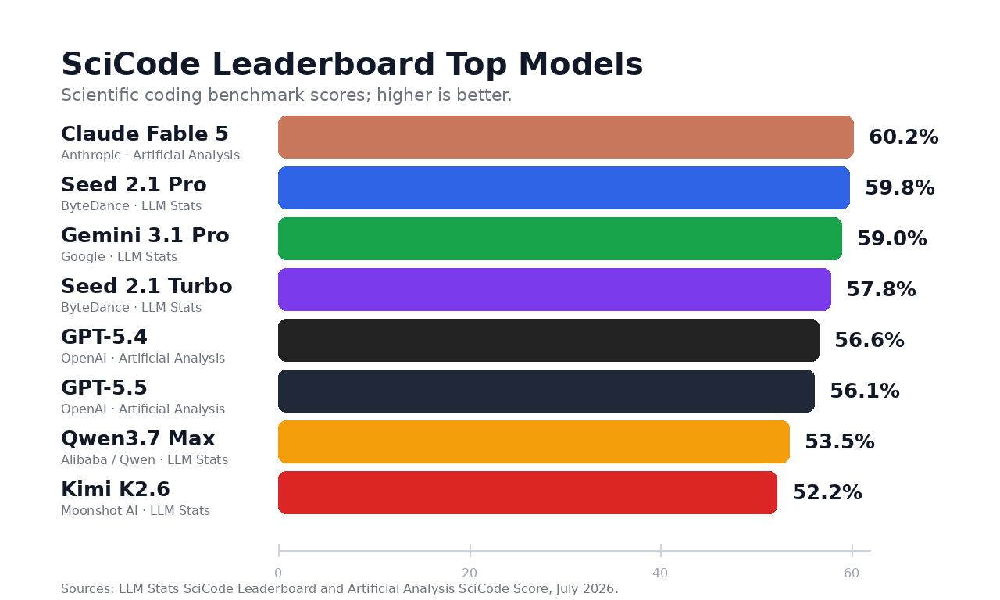
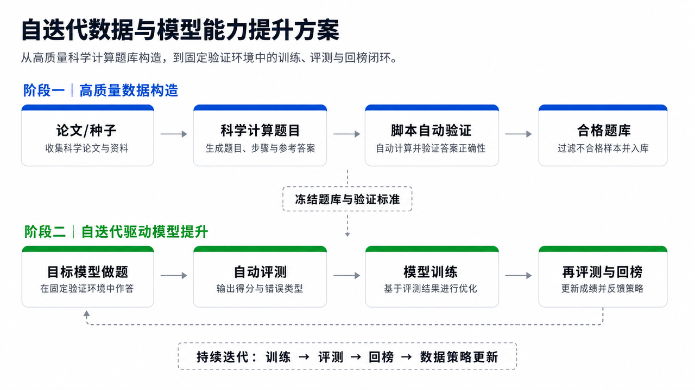
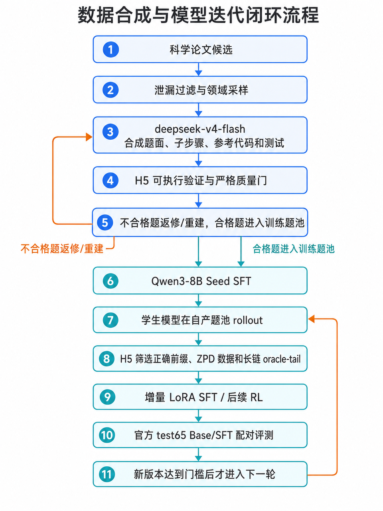

*能否通过「自动化数据生产 + 模型自迭代训练」的闭环，让开源模型在科学编程能力上持续逼近甚至超越前沿闭源模型？*

---

**熵基秩序**是一家 AI 数据研究企业，核心能力是高质量训练数据的自动化生产，已交付字节跳动、小红书等厂商的数据订单，在多智能体数据构造、难度门控、可验证数据生产方面有成熟产线。**心洲**（MindLab）是专注于 MaaS 业务和大模型后训练（RL）研究的 AI 研究团队，拥有完整的 SFT/RL 训练管线和一站式训练平台能力。双方于 2026 年 6 月建立合作，共同探索上面这个核心命题。

---

## 一、切入点：为什么是 SciCode

**SciCode** 是面向科学计算编程的高难度基准，覆盖数学、物理、化学、生物、材料等 16 个自然科学子领域，包含 80 个主问题、338 个子问题。每道题要求模型同时完成：科学背景理解 → 公式/数值推理 → 代码实现 → 测试验证。

选择 SciCode 有三个原因：

- **可验证**：结果由测试用例和脚本客观判定，不依赖人工评审或模型主观打分。
- **有空间**：头部模型（Claude Fable 5: 60.2%, GPT-5.5: 56.1%）尚未饱和，开放模型（Qwen3.6-27B: 39.8%, GLM-5.2: 50.5%）距离头部有 10–20 分差距。
- **可迁移**：围绕 SciCode 沉淀的数据产线和验证方法，可同步提升 GPQA、MMLU-Pro、LiveCodeBench 等相关基准。



**核心目标**：构建一条「高质量数据生产 → 模型自迭代提升 → 榜单验证」的闭环链路，形成可持续复制的能力体系。



---

## 二、技术方案

### 数据生产闭环（熵基秩序负责）

```
科学论文  →  题目合成  →  脚本验证  →  题库入库
   ↑                                    ↓
 策略更新  ←  评测反馈  ←  模型训练  ←  数据筛选
```

- **种子选择**：从科研论文中拉取种子，经启发式预筛 + 学科分类 + LLM 深筛（结构可构造性、知识深度）+ build gate 诊断。
- **候选生成**：DeepSeek-V4-Flash 将论文中的科学问题转写为与 SciCode 一致的多步骤科学计算任务，每道题包含科学背景、分步骤接口、参考实现、测试用例、隐藏结果。
- **多级门控验证**：参考代码执行 + H5 隐藏测试 + 物理性质检查 + 论文数值复现 + 质量门 + 正确性门 + 难度窗口。
- **返修机制**：未通过的题目按失败类型进入 targets 重试、GT 修复、返修或完整重建，不直接混入训练。

### 核心公式：难度窗口与可学习性

样本是否值得训练，不只看"难不难"，而看"能不能学"。定义目标模型得分 $w_i$（待提升模型在样本上的平均表现）、参照求解器得分 $s_i$（更强模型的平均表现）、响应落差 $\delta_i = s_i - w_i$（刻画"参照可解、目标仍有空间"）、能力区分度 $I_i = \mathrm{Var}(r_i)$（多模型评分的方差）。

合格样本需同时满足：

$$\tau_w^- \le w_i \le \tau_w^+,\qquad s_i \ge w_i + \tau_s,\qquad \delta_i \ge \tau_\delta,\qquad I_i \ge \tau_I$$

### 模型自进化闭环（心洲负责训练侧）

三步迭代：

$$D_t = A_\theta(Z_t, M_t) \quad\text{（数据生产）}$$

$$M_{t+1} = \mathrm{Train}(M_t, D_t) \quad\text{（模型训练）}$$

$$\theta_{t+1} = \mathrm{Update}\big(\theta_t,\ \mathrm{Eval}(D_t, M_t, M_{t+1})\big) \quad\text{（策略更新）}$$

训练路径为 SFT → RSI/RL 自迭代，采用**门控机制**——至少净增 2 步才接受新版本，防止把评分噪声当信号一路接受下去。



---

## 三、当前进展

### 数据生产

| 指标 | 数值 |
|---|---|
| 累计获取论文 | 276 篇 |
| 累计构建任务 | 300+ 道 |
| 长链题（≥7 步） | ~70 道 |
| 长链占比（升级后） | ~25%（对齐官方分布） |
| 产线状态 | 主产线已融合长链生产，自动按比例产出 |

产线升级关键改进（7/16–7/17）：主产线不再固定 3–6 步，按官方 test65 步数分布同时生产短链与长链；7 步以上权重放大 2×，长链目标比例 26.7%；严格返回分配的子步骤数，不满足则纠错重试，仍不满足则丢弃；标题与官方题高度相似的论文候选被拒绝，防泄漏。

### SFT / RSI 训练结果

已完成多轮 Qwen3-8B 训练实验，最新正式 RSI 链路：

| 版本 | 训练数据 | 官方 test65 | 相对上一版本 | 门控结果 |
|---|---|---|---|---|
| v0 Base | 0 | 34/288 | — | 基线 |
| v1 Seed SFT | 200 条 | 36/288 | +2 | ✅ 接受 |
| v2 RSI | 341 条 | 36/288 | 0 | ❌ 拒绝 |

**关键结论**：v1 SFT 完成了"自产数据可以带来正增益"的闭环验证——仅用 200 条自产数据，就让 Qwen3-8B 在 SciCode 官方 test65 上从 34 提升到 36。v2 未继续提升的核心原因已定位：60 道 hard-unsolved 题未形成有效 oracle-tail（`tail_rows = 0`），长链尾部数据不足，而非训练崩溃。

### 样题展示

| 样题 | 科学任务 | 步骤数 | 验证结果 |
|---|---|---|---|
| Kuramoto 振子守恒量 | 耦合振子动力学，计算交叉比，验证守恒性 | 4 步 | 19 隐藏测试全通过 + 5 项物理性质检查 |
| 黑洞 BSSN 演化 | Kerr-Schild 坐标下 Schwarzschild 黑洞演化 | 5 步 | 23 隐藏测试全通过 + 6 项物理性质 + 5 项数值检查 |
| 焦耳热有限元求解 | 电势与温度耦合的三维焦耳热问题 | 6 步 | 26 隐藏测试全通过 + 6 项边界/矩阵/数值检查 |

---

## 四、预期成果

**短期**：稳定超过 Base 的 SFT 初始化（补足长链尾部数据，使 RSI 增益跨轮累积）；完整 RSI 闭环跑通（v3+ 版本持续提升，形成可复现的 run 路径）；代码与文档交付（完整产线代码 + 训练代码 + 文档已推送至双方共建 repo）。

**中期**：SciCode 榜单回榜——开放模型（Qwen3 系列 / GLM 系列）在 SciCode 上达到或超过 50%+；方法迁移验证——将数据产线和验证方法迁移至 GPQA、MMLU-Pro、LiveCodeBench 等基准；商业化落地——数据产线直接服务于客户的高难度编程/科学推理数据需求。

**长期**：模型自我进化平台——形成"大模型出题 → 小模型做题 → 小模型训练 → 小模型变强 → 更多数据 → 递归"的一站式平台；能力体系沉淀——数据生产智能体本身也在迭代中进化，prompt、门控阈值、种子策略自动更新。

---

## 五、合作分工

| 模块 | 负责方 | 状态 |
|---|---|---|
| 数据生产管线（scicode_gendata） | 熵基秩序 | ✅ 已完成，持续迭代 |
| 训练管线（scicode_train） | 心洲 | ✅ 已跑通 |
| 一站式平台（web） | 心洲 | ✅ 已部署 |
| 数据合成 → SFT → RSI 全流程 | 双方协作 | ✅ 已跑通闭环 |
| 长链尾部数据补足 | 熵基秩序 | 🔄 进行中 |
| RSI 持续迭代 | 双方协作 | 🔄 进行中 |

---

## 六、核心价值

1. **已验证的闭环**：不是理论方案，而是已经跑通"数据生产 → SFT → 官方评测 → 正增益"的完整闭环。
2. **可验证的数据质量**：每道题经脚本执行验证，不依赖主观判断。
3. **可复制的产线**：数据生产管线已应用于字节、小红书等实际订单，方法论可迁移至任意高难度编程/推理场景。
4. **早期窗口**：目前尚未看到成熟的中小模型 SciCode 专项回榜工作，该方向仍有早期机会。
