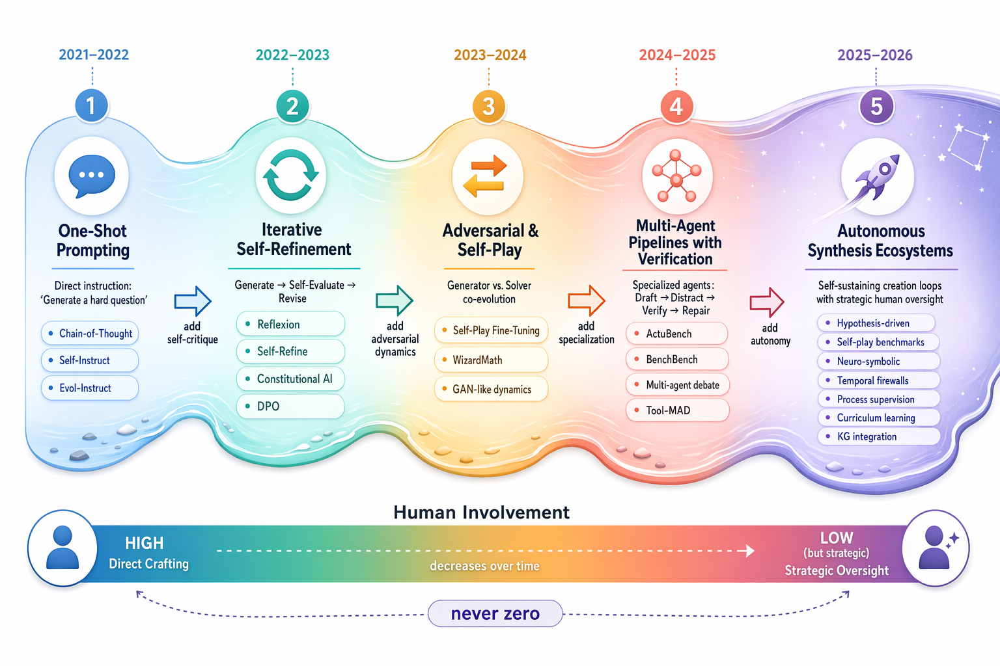
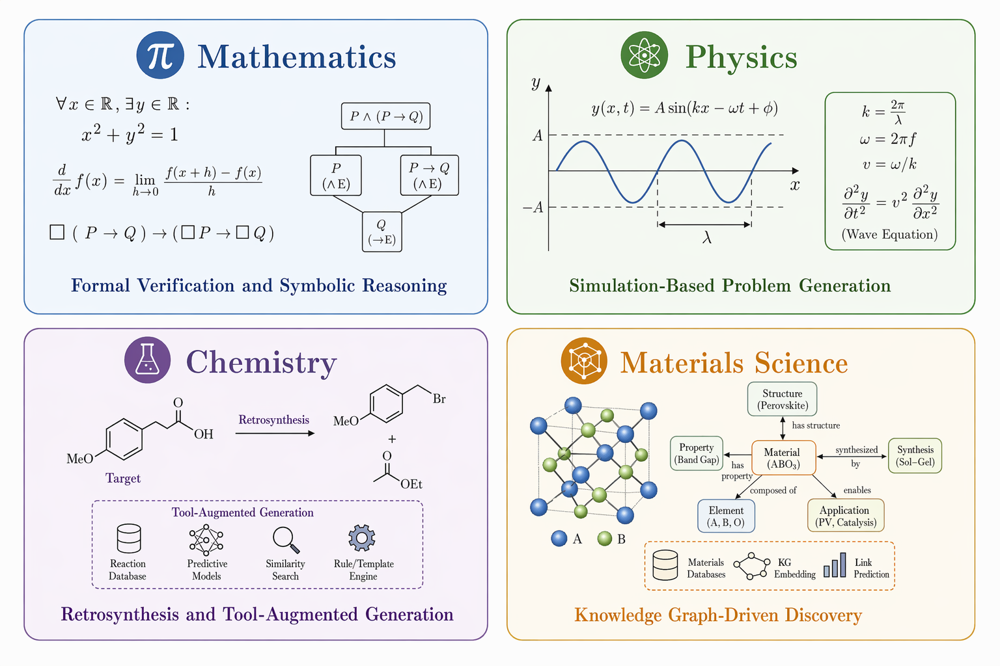

*How are LLMs themselves leveraged to synthesize assessment items of HLE-caliber difficulty at scale?*

---

静态基准正在失效。MMLU、GSM8K、MATH 这些曾经区分模型能力的基准，如今前沿模型已接近天花板；更严峻的是，Song 等人（2026）的实证污染分析表明，基准分数可能"混淆了应试能力与原理性能力"——在噪声扰动条件下，多个模型普遍出现高于基线的异常增益。**Humanity's Last Exam（HLE）** 的出现，标志着整个社区的共识：评测必须从静态题库进化为动态、抗污染、需要全谱系人类认知能力的挑战。

但 HLE 的构建方式——LLM 辅助筛选 + 专家重写——昂贵且难以规模化。这引出了一个根本问题：**能否用 LLM 自己来合成 HLE 级别难度的评测题，并且能 scale？** 本综述系统梳理了这一研究前沿，覆盖三个相互关联的支柱：(i) 自动化生成管线，(ii) 人在回路（HITL）范式，(iii) 数理化与材料等领域的具体应用，以及与之共同演化的评测生态。

---

## 一、什么是"难"：一个六维框架

在讨论如何合成难题之前，必须先严格定义"难度"。我们沿六个正交维度刻画真正的高难度评测题：

- **推理深度（Reasoning Depth）**：需要多步、非线性推理链，单步检索或一步演绎不够。物理与数学题通常需要显著更长的推理链。
- **知识广度与整合（Breadth & Integration）**：跨越多个子领域甚至学科，迫使解题者灵活调用异质知识源。
- **反直觉与创造性（Counter-intuitiveness）**：最优解路径非显而易见，能有效区分"模式匹配"与"真正泛化"。
- **信息不完备（Informational Imperfection）**：真实科研很少以完美定义的问题开始——冗余、歧义、刻意留白要求解题者过滤、提炼、假设。
- **新颖性与抗污染（Novelty）**：题目必须是真正新的，无法从现有语料或网络检索到。这是维护基准完整性最紧迫的一条。
- **清晰与可解（Clarity & Solvability）**：尽管难，题目必须良定义——精确、自洽、至少有一个可验证的解。由构造不良导致的歧义不是合法的难度，而是出题失败。

这六个维度构成了后续生成方法（§二）与评测标准（§四）的概念脚手架。

---

## 二、自动化与半自动化生成管线

我们聚焦**有已发表实验结果的具体系统**，而非抽象框架。方法演化沿着五个阶段展开：从一次性提示（Stage 1）、迭代自精炼（Stage 2）、对抗与自博弈（Stage 3）、多智能体验证（Stage 4），到当前前沿的自主合成生态（Stage 5）。

### 假设驱动的错误分析

Fu 等人提出的**假设驱动错误分析管线**是这一类的代表：第一阶段，LLM 分析目标模型在现有基准（如 MATH）上的错误模式，形成关于"哪些具体概念或技能导致失败"的显式假设——例如"该模型在需要中国剩余定理的非标准模运算场景下系统性失败"；第二阶段，针对这些被识别的弱点生成新题。

关键实证发现是**假设准确率与生成题难度之间的强正相关**：由最准确假设导出的题目，能把 Llama-3.3-70B-Instruct 在 MATH 上的准确率从 77% 压到最低 45%。这有两层含义：其一，难度不是随机的——最难的题恰恰精确命中模型的特定概念盲区，而非泛泛地"难"；其二，**错误分析是第一位的生成工具**——基准构建由诊断洞察驱动，而非难度启发式。

### 自博弈与双角色评测

**MathDuels** 引入了根本不同的范式：模型同时扮演出题者与解题者。核心洞察是**出题能力与解题能力部分解耦**——擅长解题的模型可能出平庸的题，反之亦然。管线采用三段式架构（元提示立意 → 问题生成 → 难度放大），并由独立的自动验证器剔除不良题。

其心理测量学上的创新是使用 **Rasch 模型**，从观测到的解/败矩阵中联合估计解题者能力与题目难度，产生连续、区间尺度的难度度量，比原始通过率更有信息量。MathDuels 最独特的性质是其**活基准**（living benchmark）特征：随着更强的新模型入场，它们产出的题能击败此前的霸主解题者，形成自我维持的难度攀升。

---

## 三、人在回路的协作生成

纯自动化管线尽管可 scale，但在需要极致创造力、深度领域洞察或细腻价值判断时往往力不从心。**人在回路（HITL）** 因此成为该领域最重要的范式之一。

### RLHF 及其变体

RLHF 原本用于对齐 LLM 输出的有用性、诚实性与无害性，其核心架构（SFT → 奖励模型训练 → RL 优化）可以几乎不改动地迁移到问题质量优化。适配高难度问题合成需要三处修改：(1) 指令从"回答这个问题"改为"在 [某领域] 生成一道难题"；(2) 人类专家对**生成的题目**而非答案排序，依据正是六维难度框架；(3) 奖励模型学习预测跨这些维度的复合"题目质量分"。这实质上是把领域专家的隐性知识与审美直觉量化为可优化的奖励信号。

### 显式人机协作框架

**探索—利用（exploration-exploitation）范式**通过一个闭环运作：LLM 在探索阶段生成多样化的候选题池，领域专家随后挑选最有潜力的候选、决定哪些入库、哪些需要精炼，并给出具体的自然语言修改指令。专家反馈被追加到下一轮探索的提示中。**闭环结构确保人类专长集中在价值最高处——选择与高层引导——而 LLM 承担劳动密集的候选生成。**

---

## 四、领域应用与科学管线

通用管线应用到具体科学领域，需要与领域知识表示、计算工具和方法论深度整合。

**数学**：典型管线分五阶段——从结构化知识库选取概念/定理 → 生成逻辑证明或计算骨架 → 数值与符号实例化 → 自然语言包装 → 用符号计算工具或证明助手（如 Isabelle）验证。**形式化验证的整合是数学出题区别于其他领域的标志**，它提供了客观的自动化正确性保证。

**物理与化学**：前沿管线整合外部仿真与计算工具——LLM 定义物理系统或化学反应 → 生成 COMSOL 或 Gaussian 等仿真器的输入脚本 → 运行仿真得到输出数据 → 生成要求从观测结果反推未知参数的逆问题。**ChemCrow** 是化学领域最成熟的工具增强合成管线：整合分子编辑器、安全数据库与文献检索，能自主规划合成路线，并关键地**识别文献中无解的瓶颈，自动转化为高质量研究问题**。

---

## 五、评测生态与污染危机

生成难题与评测其质量不可分割。自动化指标提供可 scale 的首轮过滤：可解性分析把生成题提交给一个或多个强解题 LLM，用通过率、解题时长、推理链复杂度近似难度；语义相似度对现有题库做嵌入余弦相似，提供污染代理。

但**金标准仍是专家沿六维度的评审**。ActuBench 的实证表明，MCQ 脚手架会抬高表现天花板，使得 judge 打分在区分前沿模型时不可或缺。LLM-as-Judge 本身也有系统性失败模式：位置偏置、冗长偏置、自我偏好、提示敏感性。BenchBench 发现**出题能力与答题能力仅中等相关（$\rho \approx 0.37$）**，这进一步复杂化了用单一模型既生成又评测的做法。

Song 等人提供了迄今最系统的**污染实证分析**：其审计框架对比"干净对照"与"噪声条件"（系统性删除、改写、扰动基准题）。核心诊断是——**一个真正干净的基准，其噪声变体不应持续优于基线**。结果令人警醒：多个模型在噪声条件下普遍出现异质的高于基线增益，表明基准相关线索可能被重新组装、重新激活污染记忆。这挑战了"基准分数直接反映真正泛化"的假设。

文献收敛于几条抗污染设计原则：**时间防火墙**（用训练截止后发表的来源重新生成基准，如 DBench-Bio、LiveMathematicianBench）、**自博弈动态生成**（不依赖固定题池）、**溯源追踪**（designer-answerer 矩阵提供审计轨迹）。

---

## 六、开放挑战与未来方向

- **方法融合与混合架构**：课程学习底座 + 对抗协作中间层 + 人在回路顶层 + RLHF 反馈环的统一多层系统，兼顾自动化的可扩展性与人类专长的深度。
- **多模态问题合成**：真实科研挑战很少纯文本——需生成整合图表、实验数据、代码、交互仿真的题，要求多模态生成与跨模态推理评测。
- **个性化自适应难度校准**：为每个学习者生成处于最近发展区（ZPD）的练习，或为研究者分析其近期发表、生成恰好挑战其知识边界的题。
- **污染与评测完整性**：新颖性与抗污染之间的张力要求基准设计的持续创新。

---

## 结语

本综述描绘的图景是：高难度问题合成正经历一场**从一次性、提示驱动的生成，走向复杂、多阶段、多智能体「创造生态」的范式转移**——沿五个阶段从原始直接提示，经迭代自精炼、对抗自博弈、多智能体验证，演进到当前定义前沿的自主合成生态。

三个相互关联的趋势定义了这场转变：**从单体到模块化架构**、**从静态到自适应系统**、**从自动化到人机协同过程**。而让 AI 系统能提出"配得上人类最后一场考试"的问题这一努力本身，正是驱动 AI 能力前进的引擎——LLM 正从被动的知识库，进化为能主动探测人类理解边界的智力伙伴。

---

*完整论文（英文，含全部参考文献）：[下载 PDF](assets/survey.pdf)*
